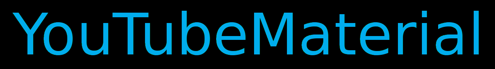
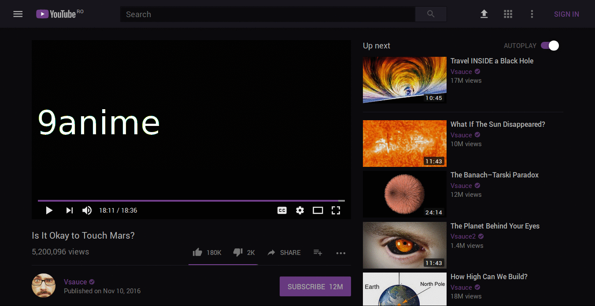

<h1 align="center">YouTube-DeepDark</h1>

</h1>

Videos should only be watched in the dark. May the dark be kinder on thine eyes. (YouTube dark theme)

# About

These are dark themes for YouTube inspired by FT DeepDark.

Credit for some of the the color palettes in use. ([@KDE](https://github.com/KDE), [@horst3180](https://github.com/horst3180), [@linuxmint](https://github.com/linuxmint), [Firefox](https://www.mozilla.org/en-US/firefox/new/), [YouTube](https://www.youtube.com/) and [Discord](https://discordapp.com/))

Code also taken from [youtube-custom-colors-video-progress-bar
](https://userstyles.org/styles/95280/youtube-custom-colors-video-progress-bar) for the video theming.

## Installing

#### Using a browser extension:
* Stylus - get the addon for [Firefox](https://addons.mozilla.org/en-US/firefox/addon/styl-us/), [Chrome](https://chrome.google.com/webstore/detail/stylus/clngdbkpkpeebahjckkjfobafhncgmne) and [Opera](https://addons.opera.com/en-gb/extensions/details/stylus/).
* This is only available using Stylus (see the [documentation](https://github.com/openstyles/stylus/wiki/Usercss)).
* Also see the documentation for information about customizing the theme. :tada:

>**NOTE: This CAN work with Stylish in Google Chrome, BUT I don't support Stylish.**

### **You can also install all my themes at once from [here](https://gitlab.com/RaitaroH/Import-All-Deepdark).**

# Material Version

# Classic Version

This version is defunct. You can still use this theme with the old YouTube.
Please follow some instructions from elsewhere. In short, you need to change a
cookie value.

For screenshots, check out the images folder.

## Contributors ✨

Thanks goes to these wonderful people ([emoji key](https://allcontributors.org/docs/en/emoji-key)):

<!-- ALL-CONTRIBUTORS-LIST:START - Do not remove or modify this section -->
<!-- prettier-ignore -->
<table>
  <tr>
    <td align="center"><a href="http://mechalynx.github.io"> <b>MechaLynx</b></a> <a href="https://github.com/RaitaroH/YouTube-DeepDark/issues?q=author%3AMechaLynx" title="Bug reports">🐛</a> <a href="https://github.com/RaitaroH/YouTube-DeepDark/commits?author=MechaLynx" title="Code">💻</a></td>
    <td align="center"><a href="https://www.mrfdev.com"> <b>Max RF</b></a> <a href="https://github.com/RaitaroH/YouTube-DeepDark/issues?q=author%3AMaxRFDev" title="Bug reports">🐛</a> <a href="https://github.com/RaitaroH/YouTube-DeepDark/commits?author=MaxRFDev" title="Code">💻</a></td>
  </tr>
</table>

<!-- ALL-CONTRIBUTORS-LIST:END -->

This project follows the [all-contributors](https://github.com/all-contributors/all-contributors) specification. Contributions of any kind welcome!
